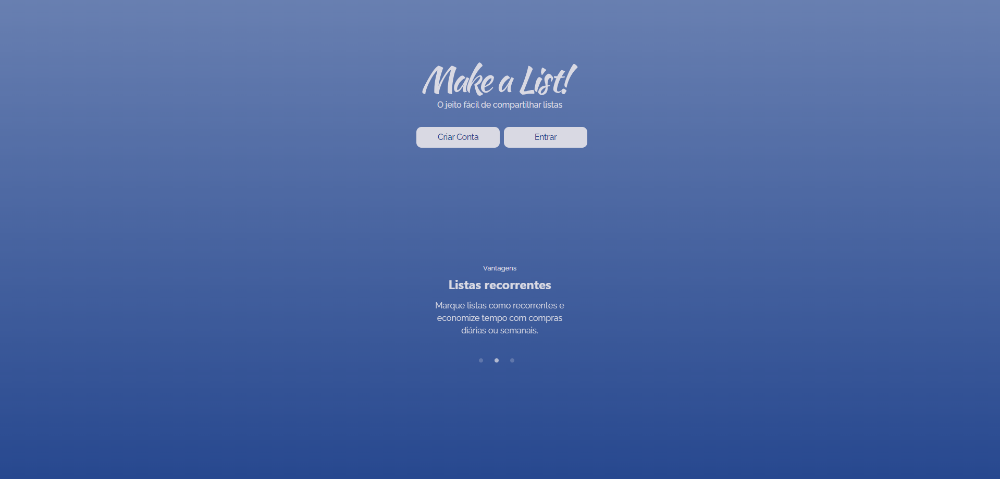

  

  

Curso: Desenvolvimento de Software Multiplataforma (Fatec - Franca/SP)

Disciplina: Projeto Integrador

Período: 3º semestre (2023/2)

## Descrição

A aplicação "Make a List!" é uma plataforma web projetada para simplificar a criação e o compartilhamento de listas de compras de supermercado e outros itens essenciais. A proposta é oferecer aos usuários uma ferramenta intuitiva e conveniente para organizar suas compras individuais e em grupo, facilitando também a colaboração entre amigos e familiares.

## :rocket: Tecnologias

### Front-End

-  [React](https://pt-br.reactjs.org/)
-  [Chakra-ui](https://chakra-ui.com/)
-  [React-Icons](https://react-icons.netlify.com/)
-  [Axios](https://github.com/axios/axios)
-  [React Router](https://reactrouter.com/web/guides/quick-start)
-  [TypeScript](https://www.typescriptlang.org/)

Além disso, o projeto foi idealizado para ser 100% responsivo, sendo capaz de ajustar-se a todos os tipos de telas, como smartphones, tablets e desktops.

[Repositório original do front-end](https://github.com/Achette/Make_a_List)

### Back-End

O servidor da aplicação foi desenvolvido utilizando a biblioteca Express, que torna capaz de usar o próprio javascript no server-side. Ele é responsável por processar todas as requisições e realizar as chamadas ao banco de dados, que foi desenvolvido utilizando o MongoDB.

-  [NodeJS](https://nodejs.org/en)
-  [MongoDB](https://www.mongodb.com/pt-br)
-  [Express](https://expressjs.com/pt-br/)
-  [Prisma](https://www.prisma.io/)
-  [bcrypt](https://www.npmjs.com/package/bcrypt)
-  [jsonwebtoken](https://www.npmjs.com/package/jsonwebtoken)
-  [validator](https://www.npmjs.com/package/validator)

[Repositório original do back-end](https://github.com/RaulSAraujo/Make_a_List_back)

## Publicação

Visite a [página de apresentação](https://makealist-presentation.vercel.app/) do projeto, ou experimente o [Make a List!](https://make-a-list.vercel.app/)

## Grupo

- Eduarda Matos (Líder)
  - Responsabilidades: Pesquisa de mercado e análise de concorrência, Definição da identidade visual (cores, tipografia, logo), Criação do design do protótipo, Testes de qualidade e usabilidade.
- Igor Achette / Gabriel Imenes
  - Responsabilidades: Desenvolvimento do Front-End da aplicação, com foco na interface do usuário e interatividade.
- Gabriel Imenes / João Paulo Falcuci
  - Responsabilidades: Documentação detalhada do projeto, incluindo requisitos e especificações, Documentação do código-fonte, Testes de qualidade e usabilidade.
- Raul Araújo
  - Responsabilidades: Desenvolvimento do Back-End da aplicação, incluindo integração com o banco de dados, Implementação de funcionalidades de compartilhamento e listas recorrentes.
